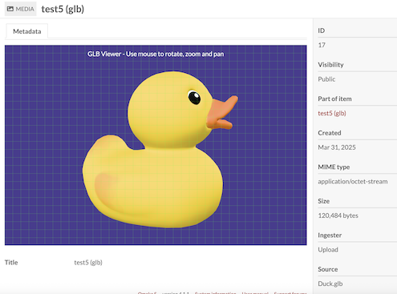

# ThreeDViewer (3D) Module for Omeka S



This module allows users to view and interact with 3D models (STL and GLB files) directly within Omeka S.

## Features

- View 3D models (STL and GLB formats) directly in the browser
- Interactive controls for rotating, zooming, and panning 3D models
- Customizable display options including background color
- Optional auto-rotation for better visualization
- Grid display option for better spatial reference

## Installation

### Manual Installation

1. Download the latest release from the GitHub repository
2. Extract the zip file to your Omeka S `modules` directory
3. Log in to the Omeka S admin panel and navigate to Modules
5. Click "Install" next to Three3DViewer

### Using Docker

A Docker Compose file is provided for easy testing:

1. Make sure you have Docker and Docker Compose installed
2. Clone this repository
3. From the repository root, run:

```bash
make up
```

4. Wait for the containers to start (this may take a minute)
5. Access Omeka S at http://localhost:8080
6. Finish the installation and login as admin user
7. Navigate to Modules and install the Three3DViewer module

## Installation

See general end user documentation for [Installing a module](http://omeka.org/s/docs/user-manual/modules/#installing-modules)

## Usage

1. Upload STL or GLB files to your Omeka S items as you would any other media file
2. When viewing an item with a 3D model, the model will automatically be displayed in an interactive viewer
3. Use your mouse to:
   - Left-click and drag to rotate the model
   - Right-click and drag to pan
   - Scroll to zoom in and out
4. The module settings allow administrators to customize the default display options

## Requirements

- Omeka S 4.x or later
- Modern browser with WebGL support (Chrome, Firefox, Safari, Edge)

## License

This module is published under the [GNU GPLv3](LICENSE) license.
